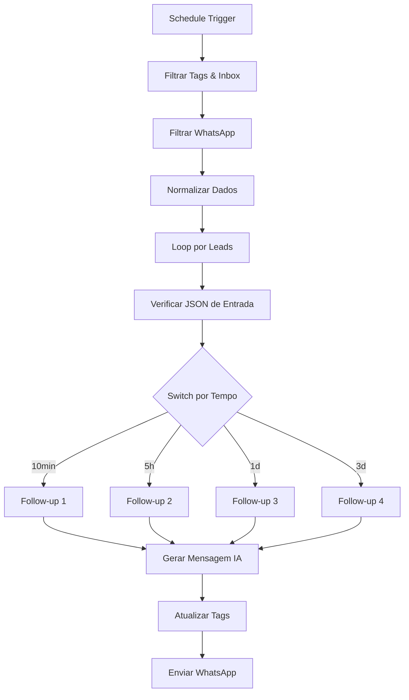

# Chatwoot N8N Follow-Up Automation

Um projeto de automação integrando **n8n** ao **Chatwoot**, com mensagens de follow-up geradas por **Inteligência Artificial**.

## 📋 Sobre o Projeto

Este workflow automatiza o envio de mensagens de follow-up para leads no WhatsApp através da integração entre n8n, Chatwoot e Evolution API. O sistema utiliza IA para gerar mensagens personalizadas e contextuais baseadas no histórico de conversas.

### ✨ Funcionalidades

- ✅ **4 níveis de follow-up** com intervalos customizáveis
- 🤖 **Mensagens geradas por IA** com contexto do histórico
- 🏷️ **Sistema inteligente de tags** para controle de fluxo
- ⏰ **Ajuste automático de horário** comercial (evita mensagens fora do expediente)
- 🔄 **Controle de loops** para evitar spam
- 📊 **Filtragem avançada** por caixa de entrada e tags

## 🛠️ Pré-requisitos

Antes de começar, você precisa ter:

- **n8n** instalado e configurado
- **Chatwoot** v4.1+ (compatível com versões anteriores)
- **Evolution API** configurada
- **PostgreSQL(Supabase)** (para histórico de conversas)
- **OpenAI API** ou outro provedor LLM
- Acesso às credenciais de todas as integrações

## 📦 Instalação

### 1. Clone ou baixe o repositório
```bash
git clone https://github.com/ViniAdss/chatwoot-n8n-followup-automation.git
```

### 2. Importe o workflow no n8n
- Abra seu n8n
- Crie um novo WorkFlow
- Vá em **Settings → Import from file**
- Selecione o arquivo `Follow-Up.json` na pasta do projeto que voce acabou de baixar

### 3. Configure as credenciais
**⚠️ IMPORTANTE:** Você deve abrir cada nó e configurar suas próprias credenciais antes de executar o workflow.

## ⚙️ Configuração

### 🏷️ 1. Criando Tags no Chatwoot

Primeiro, crie as seguintes tags no seu Chatwoot:


**Tags obrigatórias:**
- `follow-up-1` - Primeiro follow-up enviado
- `follow-up-2` - Segundo follow-up enviado  
- `follow-up-3` - Terceiro follow-up enviado
- `follow-up-4` - Quarto follow-up enviado
- `no-follow-up` - Impede envio de follow-ups

### 📧 2. Criando Atributo Personalizado

Crie um atributo personalizado chamado **`last_message`** no Chatwoot:


**Configurações:**
- **Nome:** `last_message`
- **Tipo:** Date
- **Descrição:** Armazena data/hora da última mensagem do lead

### 📥 3. Identificando Caixa de Entrada

Execute o workflow auxiliar para identificar o ID da sua caixa de entrada do WhatsApp:


1. Execute o nó **manual** → **caixas_de_entrada**
2. Localize sua caixa de entrada da Evolution
3. Copie o **ID** da caixa de entrada
4. Cole o ID no filtro do nó `filtra_tag&inbox`

### 🔧 4. Configurando Credenciais nos Nós

#### Colocando suas credenciais da Evolution API (nó `normalize`)
```javascript
baseUrl: "https://sua-evolution-api.com/"
Instance: "SuaInstancia"  
apikey: "sua-api-key-evolution"
```

#### Chatwoot
- Configure suas credenciais do Chatwoot nos nós `filtra_tag&inbox`, `getTags` e nos nós `tag`.
- Configure o **ID da caixa de entrada** encontrado no nó `caixas_de_entrada`

#### OpenAI/LLM
- Configure suas credenciais nos nós dos agentes
- Escolha o modelo de sua preferência (padrão: GPT-4o-mini)

#### PostgreSQL(Supabase)  
- Configure a conexão para armazenar histórico de conversas
- Defina quantas mensagens do histórico os agentes terão acesso

### ⏱️ 5. Configurando Intervalos de Follow-up

No nó **`switch`**, você pode personalizar os intervalos de cada follow-up:


**Padrão atual:**
- **Follow-up 1:** 10 minutos após última mensagem
- **Follow-up 2:** 5 horas após última mensagem  
- **Follow-up 3:** 1 dia após última mensagem
- **Follow-up 4:** 3 dias após última mensagem

**Para alterar um intervalo:**
Altere a função `minus()` com o valor e a unidade de tempo. Veja o exemplo:

```javascript
// Exemplo: alterar para 12 horas
{{ $json.datetimeNow.toDateTime().minus(12, 'hours') }}

// Unidades disponíveis: 'minutes', 'hours', 'days'
```

### 🤖 6. Configurando Agentes de IA

Personalize o prompt de cada agente nos nós **`Agente Follow Up 1-4`**:

**Exemplo de prompt:**
```
Você é um assistente comercial especializado em follow-up. 
Analise o histórico da conversa e crie uma mensagem personalizada 
e amigável para reengajar o lead. 
Seja natural, empático e focado em ajudar o cliente.
Retorne em seu output apenas a mensagem de follow-up
```

**Conexão com histórico:**
- Os agentes têm acesso ao histórico via ferramenta **`histórico`**
- Para desabilitar o histórico, desconecte a ferramenta

## 🧪 Testando o Workflow

### ⚠️ Modo de Teste
Durante os testes, use o nó **`isMe`** para filtrar apenas seu número:

1. Configure seu número no nó **`isMe`**
2. Execute testes sem afetar clientes reais
3. **REMOVA** este nó ao colocar em produção

### 🔄 Executando Testes
1. Configure o **Schedule Trigger** para executar a cada 1 minuto(já está configurado assim por padrão)
2. Envie uma mensagem de teste no WhatsApp
3. Aguarde os intervalos configurados
4. Verifique se as tags estão sendo aplicadas corretamente no chatwoot

## 📁 Scripts Auxiliares

### `ajustaHorario.js`
Ajusta mensagens enviadas fora do horário comercial (21h-07h) para serem reagendadas para 07h do próximo dia útil.

### `setTags.js` 
Script base para gerenciamento de tags, usado nos nós `setTags_1-4`. Voce pode alterar dentro do código as tags que deseja adicionar ou remover. Veja exemplo:

```javascript
// 🔧 Configure as tags desejadas:
const tagsParaAdicionar = ['follow-up-1'];  // ✅ Adicionar
const tagsParaRemover = ['novo-contato'];   // ❌ Remover
```

### `filtraSeteDias.js`
Filtra conversas dos últimos 7 dias para otimizar performance.

## 🎯 Fluxo do Workflow



## 📱 Integração com seu Workflow Principal

Para integrar com seu workflow de atendimento existente:

### 1. Modificar o nó Normalizador
Adicione ao seu nó de normalização:
```javascript
// Campos obrigatórios para o follow-up
conversationId: "{{ $json.body.data.chatwootConversationId }}" // Pega o Id da conversa no chatwoot
date: "{{ $json.body.data.date_time.replace('Z', '-03:00') }}" // Pega a data da mensagem
fromMe: "{{ $json.body.data.key.fromMe }}" // Verifica se a mensagem é do agente ou do lead
```

### 2. Registrar Última Mensagem
Conecte os nós da seção **"Registra última mensagem do lead"** ao nó normalizador nessa ordem:
- `isLead` - Filtra apenas mensagens de leads
- `ajusta_horário` - Ajusta horário comercial  
- `last_message` - Salva data e hora da mensagem no Chatwoot

### 3. Isolar Componentes
Mantenha o registro de mensagens separado do restante do seu workflow para não interferir no fluxo principal. Veja demonstração:


## ❗ Pontos Importantes

### ⚠️ Antes da Produção
- ✅ Teste com seu próprio número usando o nó `isMe`
- ✅ Configure todas as credenciais nos nós
- ✅ Crie todas as tags necessárias no Chatwoot
- ✅ Crie o atributo personalizado `last_message`
- ✅ **REMOVA** o nó `isMe` para funcionar com todos os leads

### 📊 Performance
- O workflow filtra automaticamente conversas dos últimos 7 dias
- Executa a cada 1 minuto por padrão (ajustável)
- Tags impedem loops infinitos de mensagens

## 🐛 Solução de Problemas

### Mensagens não estão sendo enviadas
1. ✅ Verificar se todas as credenciais estão configuradas
2. ✅ Confirmar se as tags estão criadas no Chatwoot
3. ✅ Validar se o atributo `last_message` existe
4. ✅ Checar se o ID da caixa de entrada está correto

### Tags não estão sendo aplicadas
1. ✅ Verificar permissões das credenciais do Chatwoot
2. ✅ Confirmar nomes das tags (maíusculas, minúsculas, organize tudo)
3. ✅ Validar conexões entre os nós

### IA não está gerando mensagens
1. ✅ Verificar credenciais do provedor LLM
2. ✅ Confirmar se o modelo escolhido está disponível
3. ✅ Validar conexão com histórico (se habilitado)

## 📞 Suporte

Para dúvidas ou problemas:
- Abra uma [Issue](https://github.com/ViniAdss/chatwoot-n8n-followup-automation/issues) no repositório
- Entre em contato comigo: adsvinisousa@gmail.com
- Consulte a documentação do n8n, Chatwoot e Evolution API

## 🤝 Contribuições

Contribuições são bem-vindas! Sinta-se à vontade para:
- Reportar bugs
- Sugerir melhorias  
- Enviar pull requests
- Compartilhar casos de uso

---

## 👨‍💻 Autor

<div align="center">
  
  
  **Vinicius Sousa**  
  *Desenvolvedor & Especialista em Automações*
  
  [](https://github.com/ViniAdss)
  [](mailto:adsvinisousa@gmail.com)
  
  💼 **ViniDevs** | 🌟 Transformando ideias em automações inteligentes
</div>

---

<div align="center">
  <strong>⭐ Se este projeto te ajudou, considere dar uma estrela!</strong>
</div>
